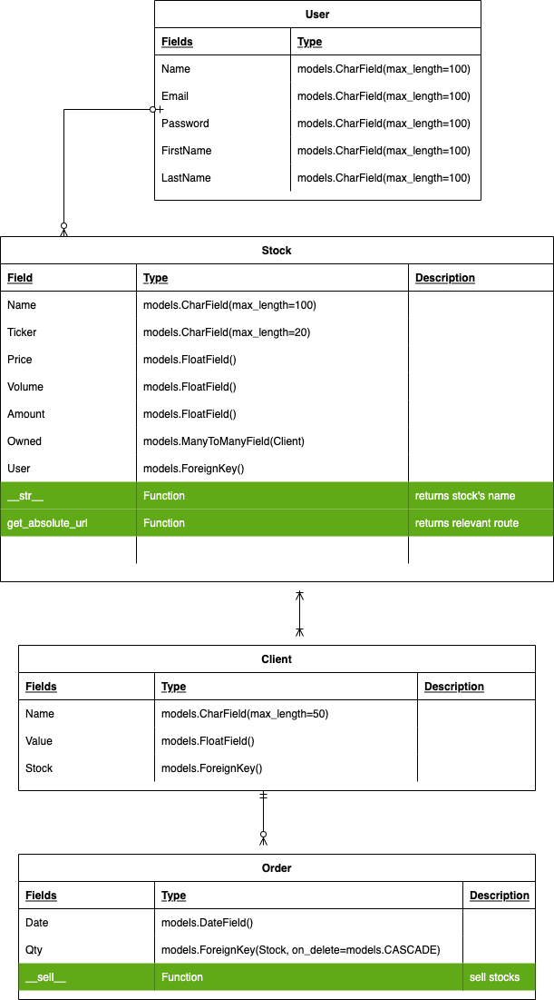
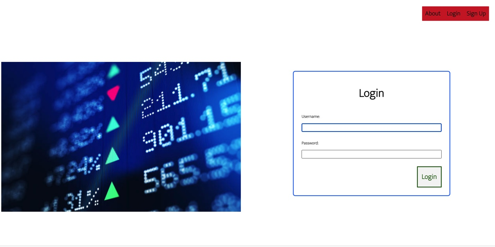
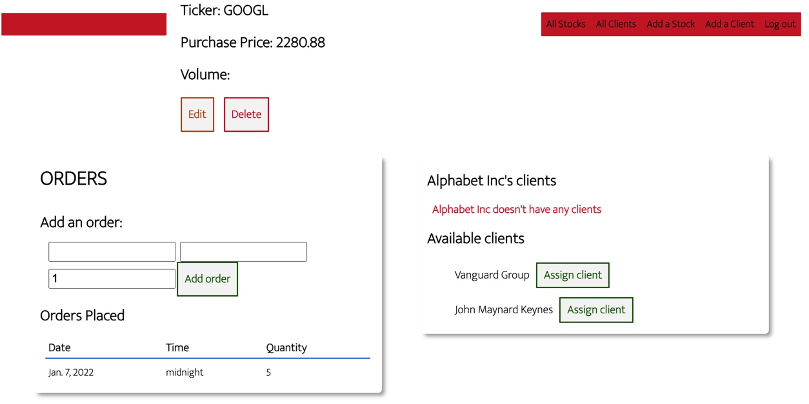

## MarketShuffle
#### A stock broker simulator 

---

 
 
 

### Introduction

MarketShuffle allows a user to play at being a stock broker. The application allows for the creation of a stock object(name, ticker, purchase price and market capitalization) and to place sell orders on said stocks. Client objects can also be created, and optionally assigned to a stock. The assignment implies that the asset order should make said client a profit: this of course being the raison d'etre of a broker

The application is very much a work in progress, and is intended to eventually include the Polygon.io API which provides live stock data. Said data would provide a difference between purchase price and actual price, making profit calculations possible.

### App Link

Check out the app: [MarketShuffle](https://marketshuffle.herokuapp.com/)

Here's the Entity Relationship Diagram:

## App Images

 

### Languages and Technologies Used
Python, Django, PostgreSQL DTL, CSS